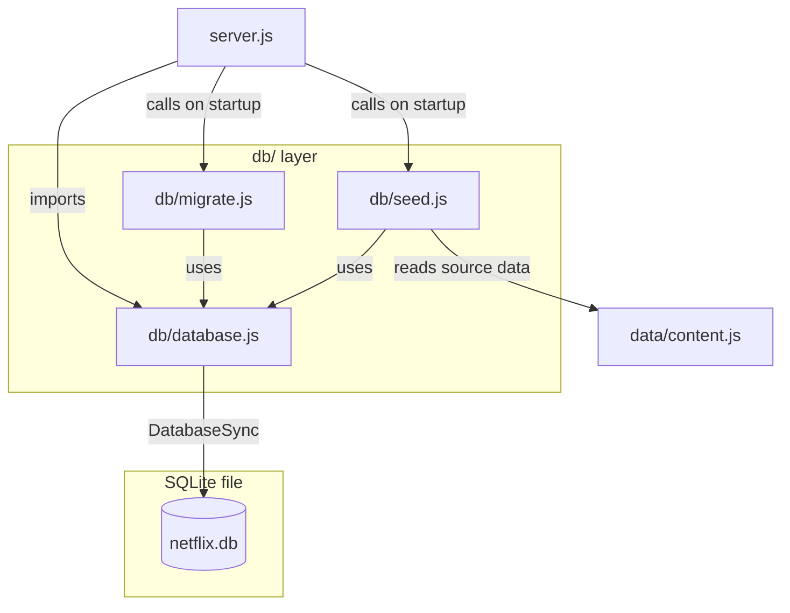

# Design Document: SQLite Database Integration

## Overview

This design replaces all in-memory mock data in the Netflix clone (`USERS` array, `PROFILES` object, `sessions` Map, and `data/content.js` require) with a persistent SQLite database using Node.js 22+'s built-in `node:sqlite` module.

The goal is zero change to external API behavior — every existing HTTP response shape stays identical. The change is purely internal: data moves from RAM to disk, and a new `db/` directory houses the database layer.

### Key Design Decisions

- **`node:sqlite` (built-in)**: No third-party ORM or driver. The built-in `DatabaseSync` API is synchronous, which fits naturally into the existing synchronous Express middleware patterns in `server.js`.
- **Singleton DB connection**: One `DatabaseSync` instance shared across all modules via `db/database.js`. Avoids connection overhead and simplifies transaction management.
- **WAL mode**: Write-Ahead Logging gives better read concurrency and crash safety with minimal configuration.
- **Synchronous startup**: Migrations and seeding run synchronously before `app.listen()`, keeping the startup sequence simple and predictable.
- **No ORM**: Direct SQL keeps the implementation transparent and avoids adding a dependency. The query layer is thin — just functions that wrap prepared statements.

---

## Architecture



### Startup Sequence

```
node server.js
  │
  ├─ require('db/database.js')   → open netflix.db, set PRAGMAs
  ├─ runMigrations()             → create/update schema
  ├─ runSeed()                   → insert default data if tables empty
  └─ app.listen(3002)            → start accepting requests
```

---

## Components and Interfaces

### `db/database.js` — Singleton Connection

```js
const { DatabaseSync } = require('node:sqlite');
const db = new DatabaseSync('./netflix.db');
db.exec('PRAGMA journal_mode = WAL');
db.exec('PRAGMA foreign_keys = ON');
process.on('exit', () => { try { db.close(); } catch {} });
module.exports = db;
```

Exports a single `DatabaseSync` instance. All other modules import this directly.

---

### `db/migrate.js` — Migration Runner

Exports one function: `runMigrations()`.

**Migration object shape:**
```js
{
  version: 1,           // INTEGER — used as primary key in schema_migrations
  up(db) { ... },       // function that applies schema changes
  down(db) { ... },     // function that reverses schema changes
}
```

**`runMigrations()` algorithm:**
1. Create `schema_migrations` table if it doesn't exist.
2. Read all applied versions from `schema_migrations`.
3. Filter migrations to those not yet applied, sort ascending by version.
4. For each pending migration, wrap in a transaction:
   - Call `migration.up(db)`
   - Insert version into `schema_migrations`
   - On error: rollback, re-throw with version in message.

**Migrations list (version → what it creates):**

| Version | Description |
|---------|-------------|
| 1 | Create `users` table |
| 2 | Create `profiles` table |
| 3 | Create `sessions` table |
| 4 | Create `content` table |

**DOWN support**: Each migration has a `down()` that drops the table it created. `runMigrations()` does not call `down()` automatically — it is available for a future `rollback(version)` utility.

---

### `db/seed.js` — Seeder

Exports one function: `runSeed()`.

**Algorithm:**
1. For each table (`users`, `profiles`, `content`), check `SELECT COUNT(*) FROM <table>`.
2. If count > 0, skip that table entirely.
3. Otherwise, insert all seed rows using prepared statements inside a transaction.

**Seed data sources:**
- `users`: hardcoded in `seed.js` (2 rows matching current `USERS` array)
- `profiles`: hardcoded in `seed.js` (6 rows matching current `PROFILES` object)
- `content`: imported from `data/content.js` (37 rows; `genres` and `rows` arrays serialized to JSON strings)

---

### Query Functions (inline in `server.js` or extracted to `db/queries.js`)

The design uses thin query functions. These can live directly in `server.js` or be extracted to a `db/queries.js` module — either approach is valid. The recommended approach is a `db/queries.js` module for testability.

**Users:**
```js
function getUserByEmail(email) {
  return db.prepare('SELECT * FROM users WHERE email = ?').get(email) ?? null;
}
function getUserById(id) {
  return db.prepare('SELECT * FROM users WHERE id = ?').get(id) ?? null;
}
```

**Profiles:**
```js
function getProfilesByUserId(userId) {
  return db.prepare('SELECT * FROM profiles WHERE user_id = ? ORDER BY sort_order ASC').all(userId);
}
function getProfileByIdAndUserId(profileId, userId) {
  return db.prepare('SELECT * FROM profiles WHERE id = ? AND user_id = ?').get(profileId, userId) ?? null;
}
```

**Sessions:**
```js
function createSession(sessionId, userId) {
  const expiresAt = Math.floor(Date.now() / 1000) + 2592000; // 30 days
  db.prepare('INSERT INTO sessions (session_id, user_id, expires_at) VALUES (?, ?, ?)').run(sessionId, userId, expiresAt);
}
function getSession(sessionId) {
  const now = Math.floor(Date.now() / 1000);
  const row = db.prepare('SELECT * FROM sessions WHERE session_id = ?').get(sessionId);
  if (!row) return null;
  if (row.expires_at <= now) {
    db.prepare('DELETE FROM sessions WHERE session_id = ?').run(sessionId);
    return null;
  }
  return row;
}
function deleteSession(sessionId) {
  db.prepare('DELETE FROM sessions WHERE session_id = ?').run(sessionId);
}
function deleteExpiredSessions() {
  const now = Math.floor(Date.now() / 1000);
  db.prepare('DELETE FROM sessions WHERE expires_at <= ?').run(now);
}
```

**Content:**
```js
function getAllContent() {
  const rows = db.prepare('SELECT * FROM content').all();
  return rows.map(row => ({
    ...row,
    genres: JSON.parse(row.genres),
    rows: JSON.parse(row.rows),
    featured: row.featured === 1 ? true : undefined,
    progress: row.progress ?? undefined,
  }));
}
```

---

### `server.js` Changes

The following replacements are made in `server.js`:

| Before | After |
|--------|-------|
| `const USERS = [...]` | removed |
| `const PROFILES = {...}` | removed |
| `const sessions = new Map()` | removed |
| `sessions.set(sessionId, userId)` | `createSession(sessionId, userId)` |
| `sessions.get(sessionId)` | `getSession(sessionId)` |
| `sessions.delete(sessionId)` | `deleteSession(sessionId)` |
| `USERS.find(u => u.email === email && u.password === password)` | `getUserByEmail(email)` + password check |
| `USERS.find(u => u.id === decoded.userId)` | `getUserById(decoded.userId)` |
| `PROFILES[userId]` | `getProfilesByUserId(userId)` |
| `profiles.find(p => p.id === profileId)` | `getProfileByIdAndUserId(profileId, userId)` |
| `require('./data/content')` | `getAllContent()` |

Startup block added before `app.listen()`:
```js
const { runMigrations } = require('./db/migrate');
const { runSeed } = require('./db/seed');
try {
  runMigrations();
  runSeed();
} catch (err) {
  console.error('[FATAL] Database initialization failed:', err.message);
  process.exit(1);
}
```

---

## Data Models

### `users` table

```sql
CREATE TABLE users (
  id         TEXT PRIMARY KEY,
  email      TEXT UNIQUE NOT NULL,
  password   TEXT NOT NULL,
  name       TEXT NOT NULL,
  plan       TEXT NOT NULL,
  created_at INTEGER DEFAULT (unixepoch())
);
```

JS object shape returned by queries:
```js
{ id, email, password, name, plan }
```

Note: `node:sqlite` returns column names as-is. Since column names use snake_case (`created_at`), the query functions only expose the camelCase fields needed by the application. `created_at` is not used in application logic.

---

### `profiles` table

```sql
CREATE TABLE profiles (
  id         TEXT NOT NULL,
  user_id    TEXT NOT NULL REFERENCES users(id),
  name       TEXT NOT NULL,
  color      TEXT NOT NULL,
  initial    TEXT NOT NULL,
  sort_order INTEGER DEFAULT 0,
  PRIMARY KEY (id, user_id)
);
```

JS object shape returned by queries:
```js
{ id, userId, name, color, initial }
```

The query function maps `user_id` → `userId` explicitly:
```js
const row = db.prepare('SELECT id, user_id as userId, name, color, initial FROM profiles WHERE ...').get(...);
```

---

### `sessions` table

```sql
CREATE TABLE sessions (
  session_id TEXT PRIMARY KEY,
  user_id    TEXT NOT NULL REFERENCES users(id),
  created_at INTEGER DEFAULT (unixepoch()),
  expires_at INTEGER NOT NULL
);
```

---

### `content` table

```sql
CREATE TABLE content (
  id          INTEGER PRIMARY KEY,
  title       TEXT NOT NULL,
  type        TEXT NOT NULL,
  seasons     INTEGER,
  duration    TEXT,
  genres      TEXT NOT NULL,   -- JSON array string
  rating      TEXT NOT NULL,
  maturity    TEXT NOT NULL,
  year        INTEGER NOT NULL,
  description TEXT NOT NULL,
  gradient    TEXT NOT NULL,
  accent      TEXT NOT NULL,
  rows        TEXT NOT NULL,   -- JSON array string
  featured    INTEGER DEFAULT 0,
  progress    INTEGER
);
```

`genres` and `rows` are stored as JSON strings (e.g., `'["Drama","Horror"]'`) and parsed back to arrays on read.

---

### `schema_migrations` table

```sql
CREATE TABLE IF NOT EXISTS schema_migrations (
  version    INTEGER PRIMARY KEY,
  applied_at INTEGER DEFAULT (unixepoch())
);
```

---

## Correctness Properties

*A property is a characteristic or behavior that should hold true across all valid executions of a system — essentially, a formal statement about what the system should do. Properties serve as the bridge between human-readable specifications and machine-verifiable correctness guarantees.*

**PBT applicability assessment**: This feature involves data transformation logic (JSON serialization/deserialization of arrays, session expiry logic, migration ordering, seeder idempotency) that has meaningful input variation and universal properties. PBT is appropriate for these layers. Infrastructure checks (schema existence, file paths) are handled as smoke/example tests.

---

### Property 1: Migration idempotency — only unapplied migrations run

*For any* set of migrations where a random subset has already been applied, running `runMigrations()` again should apply exactly the migrations not yet in `schema_migrations`, leaving the total applied count equal to the full set size.

**Validates: Requirements 2.2, 2.4**

---

### Property 2: Migrations execute in ascending version order

*For any* collection of migrations with arbitrary version numbers, `runMigrations()` should always execute them in strictly ascending order of version number, regardless of the order they are defined in the migrations array.

**Validates: Requirements 2.3**

---

### Property 3: Migration UP/DOWN round-trip restores schema state

*For any* migration, running UP followed immediately by DOWN should leave the database schema in the same state as before the UP was applied (i.e., the table created by UP no longer exists, and the version is removed from `schema_migrations`).

**Validates: Requirements 2.5, 2.6**

---

### Property 4: Failed migration is fully rolled back

*For any* migration whose `up()` function throws an error partway through, no partial schema changes should persist in the database after the error is caught.

**Validates: Requirements 2.7**

---

### Property 5: Failed migration error includes version number

*For any* migration version number V whose `up()` throws, the re-thrown error message should contain V as a substring.

**Validates: Requirements 2.8**

---

### Property 6: User query returns camelCase fields

*For any* user record inserted into the `users` table, querying by email should return a JavaScript object whose keys are exactly `id`, `email`, `password`, `name`, and `plan` (camelCase, no snake_case keys like `created_at` exposed).

**Validates: Requirements 3.3**

---

### Property 7: Profiles are returned sorted by sort_order ascending

*For any* user with any number of profiles assigned random `sort_order` values, `getProfilesByUserId()` should return the profiles in non-decreasing order of `sort_order`.

**Validates: Requirements 4.2**

---

### Property 8: Profile ownership is enforced

*For any* profile belonging to user A, calling `getProfileByIdAndUserId(profileId, userB_id)` where `userB_id ≠ userA_id` should return `null` or `undefined`.

**Validates: Requirements 4.3**

---

### Property 9: Profile query returns camelCase fields

*For any* profile record inserted into the `profiles` table, querying it should return a JavaScript object with keys `id`, `userId`, `name`, `color`, `initial` — with `user_id` mapped to `userId`.

**Validates: Requirements 4.4**

---

### Property 10: Session creation sets expires_at to now + 30 days

*For any* new session created via `createSession()`, the `expires_at` value stored in the database should be within a 5-second window of `Math.floor(Date.now() / 1000) + 2592000`.

**Validates: Requirements 5.2**

---

### Property 11: Session lookup round-trip returns correct user_id

*For any* valid `(sessionId, userId)` pair inserted via `createSession()`, calling `getSession(sessionId)` before expiry should return an object containing the same `userId`.

**Validates: Requirements 5.3**

---

### Property 12: Expired sessions return null and are deleted

*For any* session inserted with `expires_at` set to a past timestamp, calling `getSession(sessionId)` should return `null` and the row should no longer exist in the `sessions` table.

**Validates: Requirements 5.4**

---

### Property 13: Deleted sessions are not retrievable

*For any* session that has been deleted via `deleteSession(sessionId)`, a subsequent call to `getSession(sessionId)` should return `null`.

**Validates: Requirements 5.5**

---

### Property 14: Startup cleanup removes only expired sessions

*For any* mix of expired and non-expired sessions in the `sessions` table, calling `deleteExpiredSessions()` should remove all rows where `expires_at <= now` and leave all rows where `expires_at > now` intact.

**Validates: Requirements 5.7**

---

### Property 15: Content genres/rows round-trip through JSON serialization

*For any* content item with `genres` and `rows` as JavaScript arrays, inserting it into the `content` table and querying it back should return arrays deeply equal to the originals.

**Validates: Requirements 6.2, 6.3, 6.4**

---

### Property 16: Seeder is idempotent — running twice does not duplicate rows

*For any* table seeded by `runSeed()`, calling `runSeed()` a second time should leave the row count unchanged (equal to the count after the first call).

**Validates: Requirements 7.1, 7.6**

---

### Property 17: Seeded content items match source data exactly

*For any* content item from `data/content.js`, after running `runSeed()`, querying the `content` table by that item's `id` should return an object with all fields equal to the source item (with arrays deserialized).

**Validates: Requirements 7.4**

---

**Property Reflection — Redundancy Check:**

- Properties 10 and 11 are distinct: 10 tests the stored `expires_at` value, 11 tests the lookup return value. Both are kept.
- Properties 12 and 13 are distinct: 12 tests expiry-based deletion, 13 tests explicit deletion. Both are kept.
- Properties 6 and 9 are similar (camelCase fields) but test different tables with different field sets. Both are kept.
- Properties 7.1 and 7.6 from requirements both map to Property 16 — consolidated into one property.
- Properties 6.2 and 6.3 from requirements both map to Property 15 — consolidated into one round-trip property.
- Properties 2.5 and 2.6 from requirements both map to Property 3 — consolidated into one round-trip property.

No further consolidation needed. Each remaining property provides unique validation value.

---

## Error Handling

### Database Initialization Failure
If `new DatabaseSync('./netflix.db')` throws (e.g., permissions error, corrupt file), the error propagates to the startup block in `server.js`, which logs it and calls `process.exit(1)`. The server never reaches `app.listen()`.

### Migration Failure
If a migration's `up()` throws, the transaction is rolled back and the error is re-thrown with the version number prepended. The startup block catches this and exits with code 1.

### Query Errors
Individual query functions (getUserByEmail, getSession, etc.) do not catch errors — they propagate to the Express route handler, which is caught by the global error middleware:
```js
app.use((err, req, res, next) => {
  console.error('[EXPRESS ERR]', req.method, req.path, err.message);
  res.status(500).json({ error: err.message || 'Internal server error' });
});
```

### Session Expiry
Handled inline in `getSession()` — expired sessions are deleted and `null` is returned. The caller (`decodeNetflixId`) treats `null` as "not authenticated" and redirects to login.

### Missing User After Session Lookup
If `getSession()` returns a valid `userId` but `getUserById()` returns `null` (user deleted from DB), `requireAuth` clears session cookies and redirects to login — same behavior as before.

### Seeder Errors
If a seed insert fails (e.g., duplicate key on re-run without the count check), the error propagates to the startup block and exits with code 1. The count check prevents this in normal operation.

---

## Testing Strategy

### Unit Tests (example-based)

Located in `test/` or alongside modules. Use Node.js built-in `node:test` runner (available in Node 22+) with an in-memory SQLite database (`:memory:`) for isolation.

**Key example tests:**
- `getUserByEmail` returns `null` for unknown email (Requirement 3.4)
- `runSeed()` inserts exactly 2 users with IDs `u001` and `u002` (Requirement 7.2)
- `runSeed()` inserts 4 profiles for `u001` and 2 for `u002` (Requirement 7.3)
- `runMigrations()` exports a callable function (Requirement 2.9)
- API response shapes match expected structure for `/api/profiles`, `/api/content` (Requirement 8.7)

### Property-Based Tests

Use **[fast-check](https://github.com/dubzzz/fast-check)** (JavaScript PBT library). Each property test runs a minimum of **100 iterations**.

Tag format for each test: `// Feature: sqlite-database, Property N: <property_text>`

**Properties to implement as PBT:**

| Property | fast-check arbitraries |
|----------|----------------------|
| 1 — Migration idempotency | `fc.array(fc.integer({min:1,max:100}))` for version sets |
| 2 — Ascending execution order | `fc.shuffledSubarray([1,2,3,4,5])` for migration order |
| 3 — UP/DOWN round-trip | `fc.integer({min:1,max:4})` for migration version |
| 4 — Failed migration rollback | `fc.integer({min:1,max:4})` for failing migration version |
| 5 — Error includes version | `fc.integer({min:1,max:100})` for version number |
| 6 — User camelCase fields | `fc.record({id: fc.string(), email: fc.emailAddress(), ...})` |
| 7 — Profiles sorted by sort_order | `fc.array(fc.integer({min:0,max:100}))` for sort_order values |
| 8 — Profile ownership | `fc.string()` for userId values |
| 9 — Profile camelCase fields | `fc.record({id: fc.string(), userId: fc.string(), ...})` |
| 10 — Session expires_at | `fc.string()` for sessionId, `fc.string()` for userId |
| 11 — Session lookup round-trip | `fc.string()` for sessionId/userId pairs |
| 12 — Expired session returns null | `fc.integer({min:1, max:1000})` for seconds in the past |
| 13 — Deleted session not retrievable | `fc.string()` for sessionId |
| 14 — Startup cleanup | `fc.array(fc.integer())` for mixed expiry timestamps |
| 15 — Content JSON round-trip | `fc.array(fc.string())` for genres/rows arrays |
| 16 — Seeder idempotency | No arbitraries needed — run twice, check counts |
| 17 — Seeded content matches source | `fc.constantFrom(...content)` for content items |

### Integration Tests

Run against a real (non-`:memory:`) test database file. Cover:
- Full startup sequence: `runMigrations()` + `runSeed()` + verify all tables populated
- `/api/auth/login` → session created in DB → `/api/profiles` → `/api/content` → `/api/auth/logout` → session deleted
- Expired session handling end-to-end

### Smoke Tests

Verify after startup:
- `netflix.db` file exists at project root
- `PRAGMA journal_mode` returns `'wal'`
- `PRAGMA foreign_keys` returns `1`
- `schema_migrations` table exists with correct columns
- `users`, `profiles`, `sessions`, `content` tables exist
- `.gitignore` contains `netflix.db`, `netflix.db-wal`, `netflix.db-shm`
